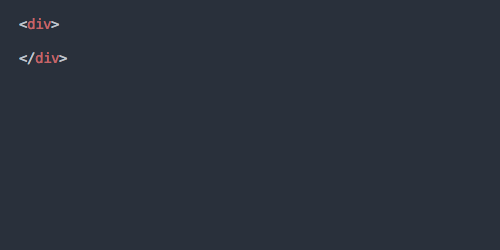
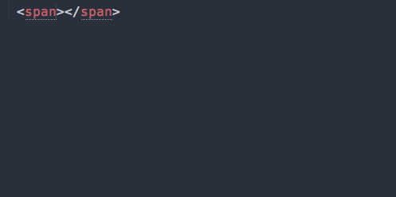

uikit-sublime
=============

### UIkit Sublime Plugin

Auto-complete plugin for UIKit classes and attributes.

### UIkit

UIkit is a lightweight and modular front-end framework for developing fast and powerful web interfaces.

* Homepage: [http://www.getuikit.com](http://www.getuikit.com)
* Twitter: [@getuikit](http://twitter.com/getuikit)

### Installation

The plugin can be installed through Sublime Text's Package Control. Just search for [UIkit autocomplete](https://sublime.wbond.net/packages/UIkit%20autocomplete).

Alternatively, you can clone this repository to the Packages directory of your Sublime installation. In Mac OS, this looks as follows:

```bash
cd ~/Library/Application Support/Sublime Text 3/Packages/
git clone git@github.com:uikit/uikit-sublime.git
```

### Usage

**Class name autocompletion**: When inside double quotes of a class attribute (`class="[HERE]"`), suggestions will appear for all `uk-` classes.



**Component attributes autocompletion**: When inside a tag, but outside of a quoted attribute string (`<div [HERE] class="uk-container" [OR-HERE]>`), suggestions will appear for all `uk-` attributes.



**Note**: In order for the suggestions to appear, your document needs to have the syntax set to `HTML` (or any child syntax like `HTML (PHP)`). You can set the syntax from the menu *View > Syntax* or via the Command Palette.

### Developer

*The following information explains how this plugin is maintained. Users do not need to care about those steps.*

To keep this plugin in sync with UIkit, class names and attributes are extracted from the UIkit code base using the included npm script.

```bash
npm install
npm run update
```

To make a new version of the plugin available via package control, a new version tag needs to be created.

## Copyright and license

Copyright 2017 [YOOtheme](http://www.yootheme.com) GmbH under the [MIT license](LICENSE.md).
